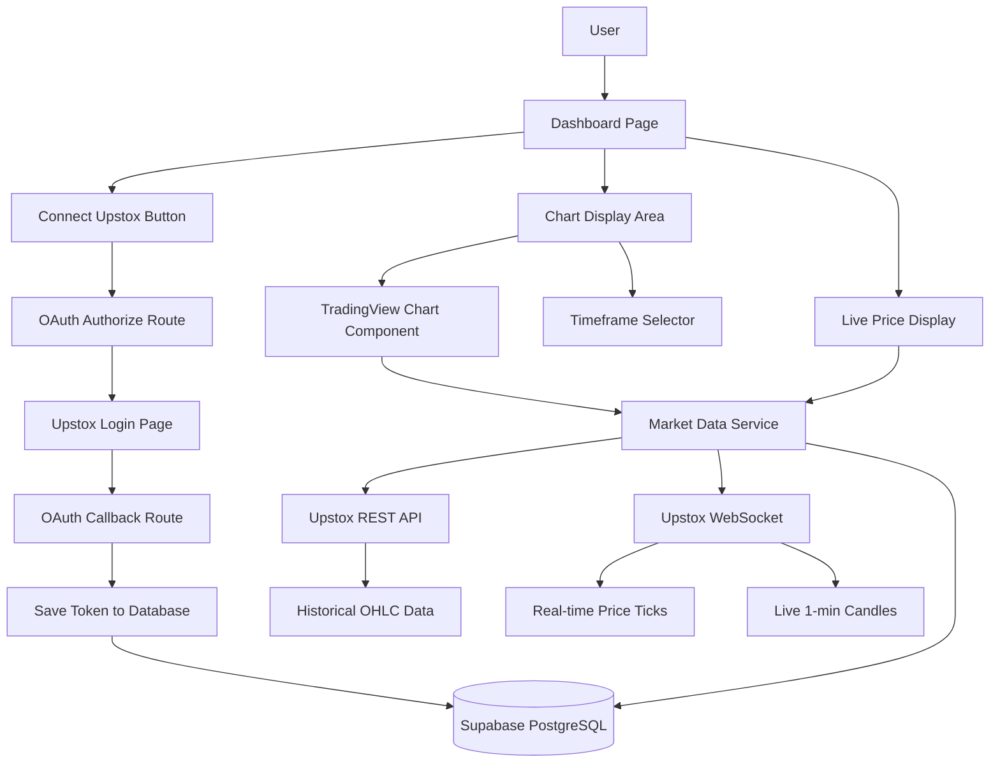
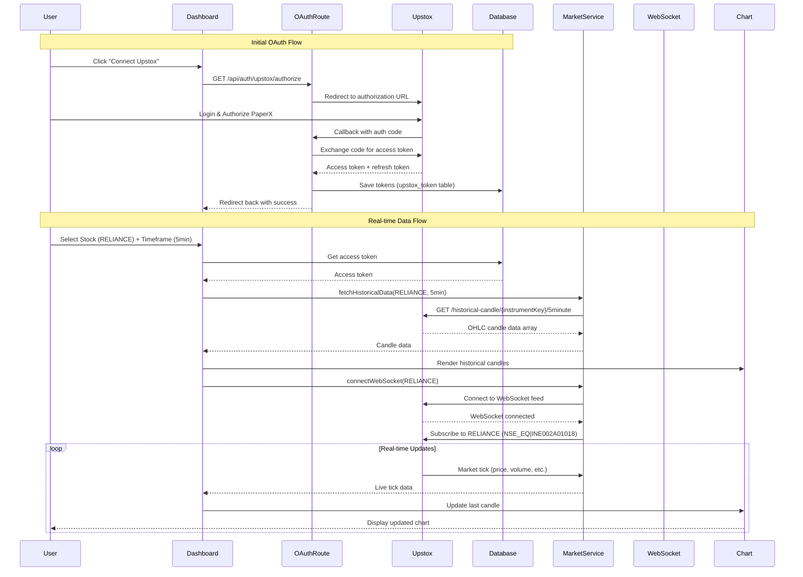

# Real-Time Indian Stock Market Data with Upstox API

## Overview

Implementing real-time NSE/BSE stock market data using **Upstox API** with OAuth 2.0 authentication, WebSocket for live updates, and TradingView Lightweight Charts for candlestick visualization.

## Upstox Developer Console Setup (IMPORTANT!)

### Fill the "Create New Regular App" Form:


| Field              | Value                                                                 |
| ------------------ | --------------------------------------------------------------------- |
| **App Name**       | `PaperX`                                                              |
| **Redirect URL**   | `http://localhost:3000/api/auth/upstox/callback`                      |
| **Primary IP**     | (Leave blank)                                                         |
| **Secondary IP**   | (Leave blank)                                                         |
| **Postback URL**   | (Leave blank for now)                                                 |
| **Order updates**  | Order Update (default)                                                |
| **Notify webhook** | (Leave blank)                                                         |
| **Description**    | `PaperX - Virtual paper trading platform with real-time NSE/BSE data` |
| **Terms checkbox** | ✅ Check and accept                                                    |


After creating the app, Upstox will provide:

- API Key (Client ID)
- API Secret

Save these immediately!

## Upstox API Capabilities

- **Cost**: FREE (₹0)
- **Delay**: TRUE real-time via WebSocket (no delay!)
- **Coverage**: NSE, BSE, MCX (all segments)
- **Data Types**: 
  - Live tick-by-tick updates
  - Historical OHLC candles (1min, 3min, 5min, 15min, 30min, 1hr, 1day)
  - Market depth (order book)
  - Live 1-minute candles in WebSocket stream
- **Rate Limits**: 100 instrument subscriptions per WebSocket connection

## Architecture Overview




## Implementation Steps

### Step 1: Update Environment Configuration

**File**: `[.env](.env)`

Add Upstox credentials (after creating app in Upstox console):

```env
# Existing NextAuth config...
NEXTAUTH_URL=http://localhost:3000
NEXTAUTH_SECRET=your_secret

# Upstox API Configuration
UPSTOX_API_KEY=your_api_key_from_upstox
UPSTOX_API_SECRET=your_api_secret_from_upstox
UPSTOX_REDIRECT_URI=http://localhost:3000/api/auth/upstox/callback
```

### Step 2: Update Database Schema

**File**: `[src/db/schema.ts](src/db/schema.ts)`

Add a new table to store Upstox OAuth tokens:

```typescript
export const upstoxTokens = pgTable("upstox_token", {
  id: text("id")
    .primaryKey()
    .$defaultFn(() => crypto.randomUUID()),
  userId: text("userId")
    .notNull()
    .references(() => users.id, { onDelete: "cascade" })
    .unique(), // One token per user
  accessToken: text("accessToken").notNull(),
  refreshToken: text("refreshToken"),
  expiresAt: timestamp("expiresAt", { mode: "date" }).notNull(),
  createdAt: timestamp("createdAt", { mode: "date" }).notNull().defaultNow(),
  updatedAt: timestamp("updatedAt", { mode: "date" }).notNull().defaultNow(),
});
```

After adding, run:

```bash
npm run db:push
```

### Step 3: Install Dependencies

```bash
npm install lightweight-charts ws
npm install @types/lightweight-charts @types/ws --save-dev
```

**Packages**:

- `lightweight-charts` - TradingView charts
- `ws` - WebSocket client for real-time data

### Step 4: Create Upstox OAuth Client

**File**: `[src/lib/upstox/client.ts](src/lib/upstox/client.ts)`

Create Upstox API client with OAuth helper functions:

```typescript
export class UpstoxClient {
  private apiKey: string;
  private apiSecret: string;
  private redirectUri: string;
  
  // Generate authorization URL
  getAuthorizationUrl(): string {
    return `https://api.upstox.com/v2/login/authorization/dialog?client_id=${apiKey}&redirect_uri=${redirectUri}&response_type=code`;
  }
  
  // Exchange auth code for access token
  async getAccessToken(code: string): Promise<TokenResponse> {
    // POST to https://api.upstox.com/v2/login/authorization/token
  }
  
  // Refresh expired access token
  async refreshAccessToken(refreshToken: string): Promise<TokenResponse> {
    // Implement token refresh
  }
}e OAuth Routes
```

### Step 5: Creat

**File**: `[src/app/api/auth/upstox/authorize/route.ts](src/app/api/auth/upstox/authorize/route.ts)`

Initiate OAuth flow - redirects user to Upstox login:

```typescript
export async function GET(request: Request) {
  const session = await getServerSession();
  if (!session) return Response.redirect('/login');
  
  const authUrl = upstoxClient.getAuthorizationUrl();
  return Response.redirect(authUrl);
}
```

**File**: `[src/app/api/auth/upstox/callback/route.ts](src/app/api/auth/upstox/callback/route.ts)`

Handle OAuth callback - save token to database:

```typescript
export async function GET(request: Request) {
  const code = searchParams.get('code');
  const session = await getServerSession();
  
  // Exchange code for token
  const tokenData = await upstoxClient.getAccessToken(code);
  
  // Save to database (upstox_token table)
  await db.insert(upstoxTokens).values({
    userId: session.user.id,
    accessToken: tokenData.access_token,
    refreshToken: tokenData.refresh_token,
    expiresAt: new Date(Date.now() + tokenData.expires_in * 1000),
  });
  
  return Response.redirect('/dashboard');
}
```

### Step 6: Create Market Data Service with Upstox

**File**: `[src/lib/marketDataUpstox.ts](src/lib/marketDataUpstox.ts)`

Comprehensive service for Upstox API integration:

**Key Features**:

- Fetch historical OHLC candles (REST API)
- Connect to WebSocket for real-time ticks
- Handle multiple timeframes (1min, 3min, 5min, 15min, 30min, 1hr, 1day)
- Automatic token refresh
- Error handling and reconnection logic

**Key Functions**:

```typescript
// Fetch historical candles
async function fetchHistoricalData(
  instrumentKey: string,
  interval: '1minute' | '3minute' | '5minute' | '15minute' | '30minute' | '60minute' | 'day',
  fromDate: string,
  toDate: string,
  accessToken: string
): Promise<CandleData[]>

// Connect to WebSocket for live updates
function connectWebSocket(
  accessToken: string,
  instrumentKeys: string[],
  onTick: (tick: TickData) => void
): WebSocket

// Get instrument key for stock symbol
function getInstrumentKey(symbol: string, exchange: 'NSE' | 'BSE'): string
// Example: RELIANCE on NSE -> 'NSE_EQ|INE002A01018'
```

**Upstox API Endpoints**:

- Historical Data: `GET https://api.upstox.com/v2/historical-candle/{instrumentKey}/{interval}/{to_date}/{from_date}`
- WebSocket: `wss://api.upstox.com/v2/feed/market-data-feed/authorize`
- Market Quote: `GET https://api.upstox.com/v2/market-quote/quotes?symbol={instrumentKey}`

**Instrument Key Format**:

```
NSE_EQ|INE002A01018  (RELIANCE on NSE Equity)
NSE_EQ|INE467B01029  (TCS on NSE Equity)
BSE_EQ|500325        (RELIANCE on BSE)
```

### Step 7: Create Candlestick Chart Component

**File**: `[src/components/charts/CandlestickChart.tsx](src/components/charts/CandlestickChart.tsx)`

React component using TradingView Lightweight Charts with real-time updates:

**Features**:

- Initialize chart with professional trading UI
- Display candlestick series with volume bars
- Support multiple timeframes (1min, 3min, 5min, 15min, 30min, 1hr, 1day)
- Real-time updates from WebSocket
- Responsive design with window resize handling
- Crosshair with price/time tooltips

**Props**:

```typescript
interface CandlestickChartProps {
  initialData: CandleData[];      // Historical candles from REST API
  symbol: string;                 // Display name (e.g., "RELIANCE")
  timeframe: Timeframe;           // Current timeframe
  onNewTick?: (tick: TickData) => void;  // WebSocket tick handler
  height?: number;                // Chart height (default: 500px)
}
```

**Chart Configuration**:

- **Candle Colors**: Green (#26a69a) bullish, Red (#ef5350) bearish
- **Volume Colors**: Green/Red with transparency
- **Grid**: Light gray lines (#e1e1e1)
- **Crosshair**: Normal mode with tooltips
- **Time Scale**: Shows date/time based on timeframe
- **Price Scale**: Right-side with auto-scaling

**Real-time Update Strategy**:

```typescript
// Update last candle with WebSocket tick
useEffect(() => {
  if (newTick) {
    candlestickSeries.update({
      time: newTick.timestamp,
      open: newTick.open,
      high: Math.max(newTick.high, newTick.price),
      low: Math.min(newTick.low, newTick.price),
      close: newTick.price
    });
  }
}, [newTick]);
```

### Step 8: Create Timeframe Selector Component

**File**: `[src/components/charts/TimeframeSelector.tsx](src/components/charts/TimeframeSelector.tsx)`

Timeframe selection UI component:

```typescript
const TIMEFRAMES = [
  { label: '1m', value: '1minute', display: '1 Minute' },
  { label: '3m', value: '3minute', display: '3 Minutes' },
  { label: '5m', value: '5minute', display: '5 Minutes' },
  { label: '15m', value: '15minute', display: '15 Minutes' },
  { label: '30m', value: '30minute', display: '30 Minutes' },
  { label: '1h', value: '60minute', display: '1 Hour' },
  { label: '1D', value: 'day', display: '1 Day' },
];
```

### Step 9: Update Dashboard with Upstox Integration

**File**: `[src/app/dashboard/page.tsx](src/app/dashboard/page.tsx)`

Complete dashboard implementation with Upstox:

**Key Features**:

1. **Upstox Connection Status**
  - Show "Connect Upstox" button if not connected
  - Display connection status and account info if connected
2. **Stock Selector**
  - Dropdown with popular NSE stocks (RELIANCE, TCS, INFY, etc.)
  - Search functionality for other stocks
3. **Timeframe Selector**
  - Horizontal buttons for 1m, 3m, 5m, 15m, 30m, 1h, 1D
  - Active state highlighting
4. **Live Quote Card**
  - Current price (from WebSocket)
  - Change and change% (green/red colored)
  - Volume, high, low, open
  - Last updated timestamp
5. **Candlestick Chart**
  - Historical data loaded on mount
  - Real-time updates from WebSocket
  - Timeframe switching
6. **Trading Panels**
  - Buy/Sell order forms
  - Pre-filled with live market price
  - Quantity input and order type selection

**Implementation Flow**:

```typescript
const [upstoxConnected, setUpstoxConnected] = useState(false);
const [selectedStock, setSelectedStock] = useState("RELIANCE");
const [timeframe, setTimeframe] = useState("5minute");
const [chartData, setChartData] = useState<CandleData[]>([]);
const [livePrice, setLivePrice] = useState<TickData | null>(null);
const [ws, setWs] = useState<WebSocket | null>(null);

// Check Upstox connection status
useEffect(() => {
  checkUpstoxConnection().then(setUpstoxConnected);
}, []);

// Fetch historical data when stock/timeframe changes
useEffect(() => {
  if (upstoxConnected) {
    fetchHistoricalData(selectedStock, timeframe).then(setChartData);
  }
}, [selectedStock, timeframe, upstoxConnected]);

// Connect WebSocket for real-time updates
useEffect(() => {
  if (upstoxConnected && selectedStock) {
    const websocket = connectWebSocket(
      selectedStock,
      (tick) => setLivePrice(tick)
    );
    setWs(websocket);
    
    return () => websocket.close();
  }
}, [selectedStock, upstoxConnected]);
```

### Step 10: Add WebSocket Handler

**File**: `[src/lib/upstox/websocket.ts](src/lib/upstox/websocket.ts)`

WebSocket connection handler with reconnection logic:

**Features**:

- Connect to Upstox WebSocket feed
- Subscribe to market data feed (mode: "full" for complete data)
- Parse binary protobuf messages
- Handle disconnections with exponential backoff
- Support multiple instrument subscriptions

**WebSocket Flow**:

```typescript
1. Get WebSocket URL from REST API
   GET https://api.upstox.com/v2/feed/market-data-feed/authorize

2. Connect to WebSocket with access token
   wss://api.upstox.com/v2/feed/market-data-feed/authorize?access_token=xxx

3. Send subscription message
   {
     "guid": "someguid",
     "method": "sub",
     "data": {
       "mode": "full",
       "instrumentKeys": ["NSE_EQ|INE002A01018"]
     }
   }

4. Receive market data updates (protobuf binary)
   - Parse using MarketDataFeed protobuf schema
   - Extract OHLC, LTP, volume, bid/ask, etc.
```

### Step 11: Testing & Verification

**Test Checklist**:

1. ✅ Upstox OAuth flow works (login and token storage)
2. ✅ Historical candle data loads for all timeframes
3. ✅ WebSocket connects and receives live updates
4. ✅ Chart renders with historical data
5. ✅ Chart updates in real-time with WebSocket ticks
6. ✅ Timeframe switching works correctly
7. ✅ Multiple stocks can be selected
8. ✅ Token refresh works when expired
9. ✅ Error handling for API failures
10. ✅ Reconnection logic for WebSocket disconnections

## Complete Data Flow Diagram




## Upstox Instrument Key Format

Upstox uses instrument keys instead of simple symbols:


| Stock    | Exchange | Instrument Key |
| -------- | -------- | -------------- |
| RELIANCE | NSE      | `NSE_EQ        |
| TCS      | NSE      | `NSE_EQ        |
| INFY     | NSE      | `NSE_EQ        |
| HDFCBANK | NSE      | `NSE_EQ        |
| RELIANCE | BSE      | `BSE_EQ        |


**Format**: `{EXCHANGE}_{SEGMENT}|{IDENTIFIER}`

- Exchange: NSE, BSE, MCX
- Segment: EQ (equity), FO (futures & options), CD (currency derivatives)
- Identifier: ISIN code (NSE) or Scrip code (BSE)

You'll need to create a mapping file or use Upstox's instrument search API.

## Important Upstox API Notes

### Rate Limits

- **REST API**: 250 requests per second
- **WebSocket**: 100 instrument subscriptions per connection
- **Historical Data**: Limited to 1000 candles per request

### Market Hours

- **Pre-open**: 9:00 AM - 9:15 AM IST
- **Regular**: 9:15 AM - 3:30 PM IST
- **After-hours**: WebSocket may not stream outside market hours

### WebSocket Data Modes

- **ltpc** (Last Traded Price): Minimal data (LTP, time, volume, close)
- **full** (Recommended): Complete data (OHLC, depth, bid/ask, 1-min candles)
- **option_chain**: For options data (coming soon)

### Token Expiration

- Access tokens expire after 24 hours
- Implement automatic refresh using refresh token
- Store expiry time in database for proactive refresh

## Performance Optimizations

1. **WebSocket Connection Pooling**
  - Reuse single WebSocket for multiple instruments
  - Subscribe to max 100 instruments per connection
2. **Data Caching**
  - Cache historical data for 1 minute
  - Avoid refetching on quick timeframe switches
3. **Debouncing**
  - Debounce stock selection changes (300ms)
  - Prevent rapid API calls during dropdown navigation
4. **Chart Optimization**
  - Use TradingView's built-in data compression
  - Limit visible candles for better performance
  - Enable hardware acceleration for rendering
5. **Token Management**
  - Check token expiry before each API call
  - Refresh proactively 5 minutes before expiry
  - Handle token refresh in background

## Error Handling Strategy


| Error Type           | Handling                                             |
| -------------------- | ---------------------------------------------------- |
| OAuth failure        | Redirect to connection page with error message       |
| Token expired        | Auto-refresh and retry request                       |
| WebSocket disconnect | Exponential backoff reconnection (1s, 2s, 4s, 8s...) |
| API rate limit       | Queue requests with delay                            |
| Invalid instrument   | Show error, fallback to default stock                |
| Market closed        | Display message, show last available data            |


## Future Enhancements (Phase 2)

- Technical indicators overlay (MA, EMA, Bollinger Bands, RSI, MACD)
- Drawing tools (trendlines, Fibonacci retracement)
- Multiple chart layouts (split view for comparing stocks)
- Watchlist with real-time price updates
- Market depth (L2 order book) visualization
- Options chain viewer with Greeks
- Futures & Options trading support
- Alerts and price notifications
- Export chart as image/PDF
- Historical portfolio performance tracking

## Security Considerations

1. **Never expose API credentials client-side**
  - All Upstox API calls must go through your backend
  - Store secrets in `.env` only, never in frontend code
2. **Token Storage**
  - Encrypt access tokens in database
  - Never send tokens to client
  - Use server-side sessions
3. **API Proxy**
  - Create Next.js API routes as proxy
  - Example: `/api/market-data` → calls Upstox API server-side
4. **Rate Limiting**
  - Implement per-user rate limits
  - Prevent abuse of your Upstox quota

